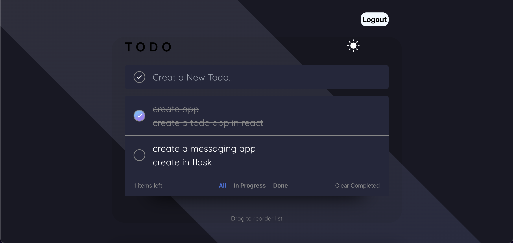

# ToDo APP

## Description

- Switch between day mode and dark mode
- Responsive with all devices
- Add and remove tasks
- Check for completed
- Filters for showing completed or non-completed tasks

## Technology stack

1. React JS
2. Node JS
3. Tailwind CSS
4. OAuth

## Link

- Working: [Link](https://drive.google.com/file/d/1wYZZYaimcFgiCZWNhh3GoK1UjHysW9Ap/view?usp=sharing)

## Output

|  |  |
| :----------------------------: | :--------------------------: |
|           Login Page           |             Home             |

|  |  |
| :----------------------------------: | :-----------------------------------: |
|             Create Task              |             Task Complete             |

|  |
| :--------------------------------: |
|             Dark Theme             |
